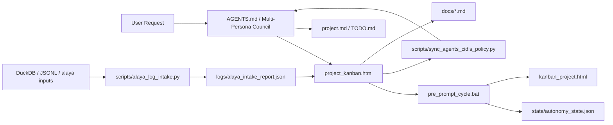

# CIDLS Data Flow

```mermaid
flowchart LR
  User["User Request"] --> Agents["AGENTS.md / Multi-Persona Council"]
  Agents --> Board["project_kanban.html"]
  Agents --> Mirror["project.md / TODO.md"]
  Board --> Hook["pre_prompt_cycle.bat"]
  Hook --> State["state/autonomy_state.json"]
  Hook --> MirrorBoard["kanban_project.html"]
  Board --> Sync["scripts/sync_agents_cidls_policy.py"]
  Sync --> Agents
  Logs["DuckDB / JSONL / alaya inputs"] --> Intake["scripts/alaya_log_intake.py"]
  Intake --> Report["logs/alaya_intake_report.json"]
  Report --> Board
  Board --> Docs["docs/*.md"]
```
